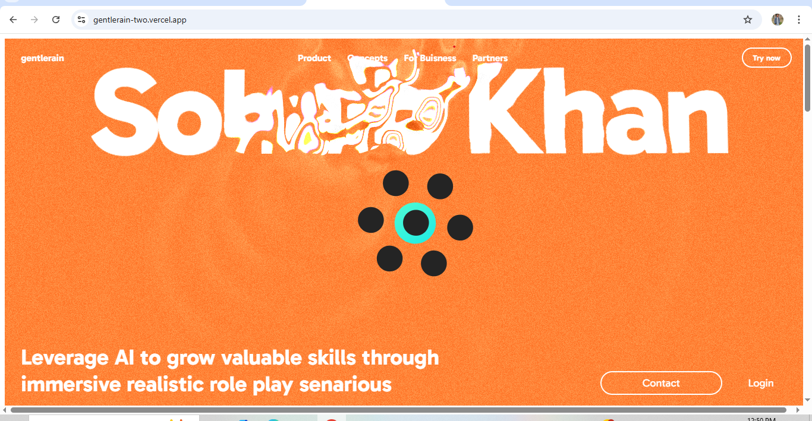

<h1 align="center">🌧️ GentleRain</h1>

<p align="center">
  A calming, animated waterdrop-themed web experience built with love, minimalism, and pure frontend magic.  
</p>

<p align="center">
  <a href="https://gentlerain-two.vercel.app/" target="_blank"><strong>🔗 Live Demo</strong></a> • 
  <a href="https://github.com/Sohaibkundi2/gentlerain" target="_blank"><strong>📁 GitHub Repo</strong></a>
</p>

---

## 📸 Preview



---

## ✨ Features

- 🌧️ Ambient waterdrop animation
- 🌌 Peaceful and aesthetic visuals
- 🎨 Clean, minimal UI design
- 🎯 Cursor-following elements for immersive interaction  
- 📜 Scroll-triggered animations
- 📱 Fully responsive design
- ⚙️ Smooth transitions and effects *(GSAP if used)*

---

## 🛠️ Tech Stack

- 💻 **HTML5**
- 🎨 **CSS3**
- ⚙️ **JavaScript**
- 🎞️ **GSAP**
- 🧠 Scroll & Mouse Interactivity

---
## 🚀 Getting Started
To run the project locally:

```bash
git clone https://github.com/Sohaibkundi2/gentlerain.git
cd gentlerain
open index.html
```
- No build tools needed — it's pure frontend.
---
## 📂 Folder Structure

```bash
gentlerain/
├── index.html
├── style.css
├── script.js
└── screenshout.png
```
```
🌧️ "Let the waterdrop wash away the noise — one smooth animation at a time."
```

## 🙌 Author
Made with ☔ and ❤️ by <a href="https://github.com/sohaibkundi2" target="_blank"><strong>Sohaib Kundi </strong></a> •
